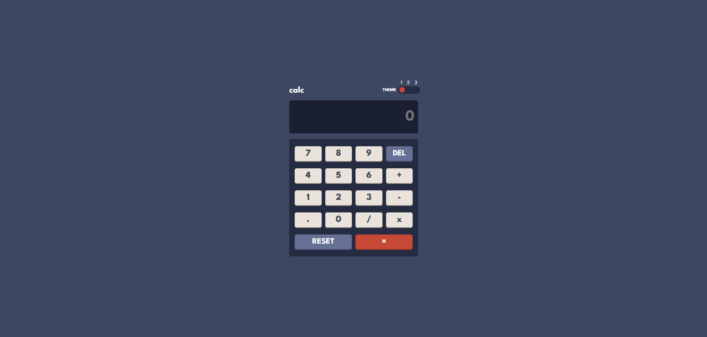

# Frontend Mentor - Calculator app solution

This is a solution to the [Calculator app challenge on Frontend Mentor](https://www.frontendmentor.io/challenges/calculator-app-9lteq5N29). Frontend Mentor challenges help you improve your coding skills by building realistic projects.

## Table of contents

- [Overview](#overview)
  - [The challenge](#the-challenge)
  - [Screenshot](#screenshot)
  - [Links](#links)
- [My process](#my-process)
  - [Built with](#built-with)
  - [What I learned](#what-i-learned)
  - [Continued development](#continued-development)
  - [Useful resources](#useful-resources)
- [Author](#author)

## Overview

### The challenge

Users should be able to:

- See the size of the elements adjust based on their device's screen size
- Perform mathmatical operations like addition, subtraction, multiplication, and division
- Adjust the color theme based on their preference

### Screenshot

### Links

- Solution URL: [Add solution URL here](https://github.com/wilfriedrouyer/calculator)

## My process

### Built with

- Semantic HTML5 markup
- CSS custom properties
- Flexbox
- CSS Grid
- Mobile-first workflow
- [React](https://reactjs.org/) - JS library

### What I learned

The part that I had the most trouble to deal with was the usage of flexboxes. This concept is important and quite usefull in CSS and I think I have progressed during this challenge.

As a beginner in React, the constraint of the Theme Mode was a really challenge and it made me learn the useContext function.
For more details :

### Continued development

Use this section to outline areas that you want to continue focusing on in future projects. These could be concepts you're still not completely comfortable with or techniques you found useful that you want to refine and perfect.

### Useful resources

- [useContext Documentation](https://fr.react.dev/reference/react/useContext) - This helped me to undestand the useContext concept and how to use it.
- [Flexbox Guide](https://css-tricks.com/snippets/css/a-guide-to-flexbox/) - This guide is really complete and clear to undestand the various possibilites with the flexboxes.

## Author

- Frontend Mentor - [@wilfriedrouyer](https://www.frontendmentor.io/profile/wilfriedrouyer)
